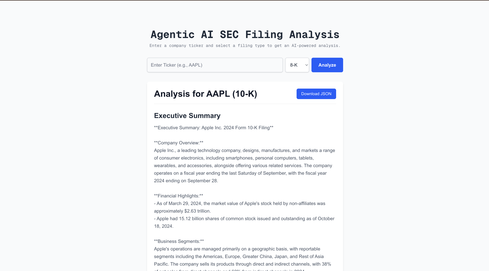

# Agentic SEC Analyzer

An agentic AI platform to analyze SEC filings (10-K, 10-Q, 8-K). This project uses a multi-agent system with LangChain to generate summaries, extract financial KPIs, identify risks, and answer questions about the filings. The application is built with a Next.js frontend and a FastAPI backend.

This project was developed to fulfill the "Agentic AI Platform for SEC Filings Analysis" assignment.

## ✨ Live Demo

**Frontend (Vercel):** [https://agentic-sec-analyzer.vercel.app](https://agentic-sec-analyzer.vercel.app)  
**Backend (Railway):** [https://agentic-sec-analyzer-production.up.railway.app](https://agentic-sec-analyzer-production.up.railway.app)

## ✨ Features

-   **Multi-Filing Support:** Analyze annual (10-K), quarterly (10-Q), and material event (8-K) reports for any publicly traded US company.
-   **AI-Powered Analysis:** A team of specialized AI agents works in parallel to:
    -   Generate a high-level **Executive Summary**.
    -   Extract key **Financial KPIs** (Total Revenue, Net Income, EPS).
    -   Identify and list the top **Risk Factors**.
-   **Interactive Q&A:** A chat interface powered by a RAG (Retrieval-Augmented Generation) pipeline allows you to ask specific questions about the filing content.
-   **Modern Frontend:** A clean, responsive, and user-friendly interface built with Next.js and Tailwind CSS.
-   **Optimized Performance:** The backend leverages `asyncio` to run independent AI agent calls concurrently, significantly reducing report generation time.
-   **Intelligent Caching:** The application caches generated reports and vector stores in memory to provide instant responses for repeated requests.

## 📸 Screenshot



## 🛠️ Tech Stack

-   **Frontend:** Next.js, React, Tailwind CSS
-   **Backend:** Python, FastAPI, Uvicorn
-   **AI/ML:** LangChain, OpenAI (GPT-4o)
-   **Vector Database:** ChromaDB (for RAG pipeline)
-   **Data Source:** `sec-api.io` for fetching filings
-   **Deployment:** Vercel (Frontend), **Railway (Backend)**

## 🚀 Getting Started

Follow these instructions to set up and run the project locally.

### Prerequisites

-   [Node.js](https://nodejs.org/en/) (v18.0 or later)
-   [Python](https://www.python.org/downloads/) (v3.12 or later)
-   [Conda](https://docs.conda.io/en/latest/miniconda.html) (Recommended for managing Python environments)

### Installation & Setup

1.  **Clone the repository:**
    ```
    git clone https://github.com/your-username/agentic-sec-analyzer.git
    cd agentic-sec-analyzer
    ```

2.  **Setup the Backend:**
    ```
    # Navigate to the backend directory
    cd backend

    # Create and activate a conda environment
    conda create --name sec-analyzer-env python=3.12
    conda activate sec-analyzer-env

    # Install Python dependencies
    pip install -r requirements.txt

    # Create a .env file in the 'backend' directory
    touch .env
    ```
    Add your API keys to the `.env` file:
    ```
    OPENAI_API_KEY="your_openai_api_key_here"
    SEC_API_KEY="your_sec-api.io_key_here"
    ```

3.  **Setup the Frontend:**
    ```
    # Navigate to the frontend directory from the root
    cd ../frontend

    # Install npm packages
    npm install

    # Create a .env.local file in the 'frontend' directory
    touch .env.local
    ```
    Add the local backend URL to your `.env.local` file:
    ```
    NEXT_PUBLIC_API_BASE_URL=http://127.0.0.1:8000
    ```

### Running the Application

You'll need two separate terminal windows to run both the backend and frontend servers.

1.  **Run the Backend Server:**
    ```
    # In terminal 1, navigate to the backend directory
    cd backend
    conda activate sec-analyzer-env
    uvicorn main:app --reload
    ```
    The backend will be running at `http://127.0.0.1:8000`.

2.  **Run the Frontend Server:**
    ```
    # In terminal 2, navigate to the frontend directory
    cd frontend
    npm run dev
    ```
    The frontend will be running at `http://localhost:3000`.

Open `http://localhost:3000` in your browser to use the application.

## ☁️ Deployment

This application is configured for easy deployment to modern hosting platforms.

-   The **Frontend** can be deployed to **Vercel** by importing the GitHub repository and setting the root directory to `frontend`.
-   The **Backend** is deployed to **Railway** as a Web Service.
    -   Set the **Root Directory** to `backend`.
    -   Railway will automatically use the `Procfile` to determine the start command: `web: uvicorn main:app --host 0.0.0.0 --port $PORT`.

Remember to set the `OPENAI_API_KEY`, `SEC_API_KEY`, and `FRONTEND_URL` environment variables on Railway, and the `NEXT_PUBLIC_API_BASE_URL` on Vercel.

## Challenges & Solutions

Deploying this full-stack AI application involved solving several real-world challenges:
-   **CORS Errors:** Fixed by explicitly setting the `FRONTEND_URL` in the backend's `CORSMiddleware`.
-   **Build Timeouts:** The initial build failed due to the large size of PyTorch. This was solved by modifying `requirements.txt` to force a CPU-only installation, significantly reducing build time.
-   **Memory Exhaustion:** The server crashed on startup because it tried to load the large sentence-transformer model into memory immediately. This was fixed by deferring the model loading until it was actually needed by the Q&A function.
-   **Server-Side Connection Errors:** The backend initially failed to connect to external APIs. This was solved by adding `certifi` to the project to provide the necessary SSL certificates.

## 📄 License

Distributed under the MIT License. See `LICENSE` for more information.
